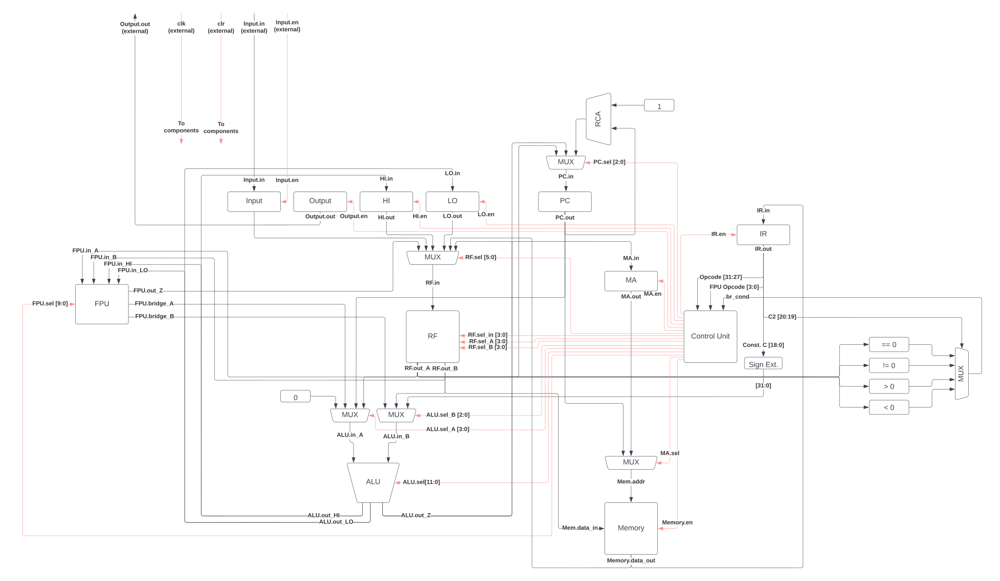

# CPU Design Project: Heart of Gold (HoG)

## Abstract

This is a CPU designed and implemented by [Alex O'Neill](https://github.com/alcatrazEscapee) and [Jared McGrath](https://github.com/jaredmcgrath) for ELEC 374 Digital Systems Engineering at Queen's University.

The Heart of Gold (HoG) CPU is a 32-bit CPU based on the 3-Bus architecture of the Mini SRC. It supports a simple RISC instruction set, variable-clock-cycle instruction execution, IEEE-754 single precision floating-point arithmetic with a 2 kB, 512 word addressable memory, and synchronous I/O. The HoG operates at a 12.5 MHz clock speed (with a theoretical maximum fmax of 16.74 MHz).

### Specification

#### Instruction Types

There are six instruction formats; the five instruction formats (unmodified) from Mini SRC design, plus one floating-point instruction format.

| Type                       | Fields                                                   |
| -------------------------- | -------------------------------------------------------- |
| R - Three Register         | `[5b Opcode][4b rA][4b rB][4b rC][15b --------------- ]` |
| I - Two Register Immediate | `[5b Opcode][4b rA][4b rB][19b ------------ Constant C]` |
| B - Branch                 | `[5b Opcode][4b rA][4b C2][19b ------------ Constant C]` |
| J - Jump / IO              | `[5b Opcode][4b rA][23b ----------------------------- ]` |
| M - Misc / Special         | `[5b Opcode][27b ------------------------------------ ]` |
| F - Floating Point         | `[5b Opcode][4b fA][4b fB][4b fC][11b][4b - FPU Opcode]` |

#### Instructions

The below table defines the instructions implemented by the HoG CPU. Some `R`-type instructions use only a subset of the available registers, but unless otherwise noted, the general expression is `rA <- rB <op> rC`, where:

- `rA` is the first register, and is the register used to write to the register file (destination register).
- `rB` is the left input to the ALU
- `rC` is the right input to the ALU
- `C` is the 19-bit (sign-extended to 32-bits) constant for `I`/`B`-type instructions.
- `C2` is the 4-bit field representing the comparison operation for conditional branches (see below).

| Index | Opcode  | Name                     | Assembly              | RTN                                     |
| ----- | ------- | ------------------------ | --------------------- | --------------------------------------- |
| 0     | `00000` | Load                     | `ld rA, C(rB)`        | `rA <- Memory[rB + C]`                  |
| 1     | `00001` | Load Immediate           | `ldi rA, C(rB)`       | `rA <- rB + C`                          |
| 2     | `00010` | Store                    | `st C(rB), rA`        | `Memory[rB + C] <- rA`                  |
| 3     | `00011` | Add                      | `add rA, rB, rC`      | `rA <- rB + rC`                         |
| 4     | `00100` | Subtract                 | `sub rA, rB, rC`      | `rA <- rB - rC`                         |
| 5     | `00101` | Shift Right              | `shr rA, rB, rC`      | `rA <- rB >> rC`                        |
| 6     | `00110` | Shift Left               | `shl rA, rB, rC`      | `rA <- rB << rC`                        |
| 7     | `00111` | Rotate Right             | `ror rA, rB, rC`      | `rA <- (rB >> rC) \| (rB << (32 - rB))` |
| 8     | `01000` | Rotate Left              | `rol rA, rB, rC`      | `rA <- (rB << rC) \| (rB >> (32 - rB))` |
| 9     | `01001` | And                      | `and rA, rB, rC`      | `rA <- rB & rC`                         |
| 10    | `01010` | Or                       | `or rA, rB, rC`       | `rA <- rB \| rC`                        |
| 11    | `01011` | Add Immediate            | `addi rA, rB, C`      | `rA <- rB + C`                          |
| 12    | `01100` | And Immediate            | `andi rA, rB, C`      | `rA <- rB & C`                          |
| 13    | `01101` | Or Immediate             | `ori rA, rB, C`       | `rA <- rB \| C`                         |
| 14    | `01110` | Multiply                 | `mul rB, rC`          | `HI, LO <- rB * rC`                     |
| 15    | `01111` | Divide                   | `div rB, rC`          | `HI, LO <- rB / rC`                     |
| 16    | `10000` | Negate                   | `neg rA, rB`          | `rA <- -rB`                             |
| 17    | `10001` | Not                      | `not rA, rB`          | `rA <- ~rB`                             |
| 18    | `10010` | Conditional Branch       | `br<condition> rA, C` | `if condition(rA) then PC <- PC + C`    |
| 19    | `10011` | Jump (Return)            | `jr rA`               | `PC <- rA`                              |
| 20    | `10100` | Jump and Link (Call)     | `jal rA`              | `r15 <- PC + 1, PC <- rA`               |
| 21    | `10101` | Input                    | `in rA`               | `rA <- Input`                           |
| 22    | `10110` | Output                   | `out rA`              | `Output <- rA`                          |
| 23    | `10111` | Move from HI             | `mfhi rA`             | `rA <- HI`                              |
| 24    | `11000` | Move from LO             | `mflo rA`             | `rA <- LO`                              |
| 25    | `11001` | Noop                     | `nop`                 | Noop                                    |
| 26    | `11010` | Halt                     | `halt`                | Halt                                    |
| 27    | `11011` | Floating Point Operation | Various               | Various                                 |

Branch instructions use the two low-order bits of the `C2` field to determine the type of condition:

| `C2` | Condition          | Assembly     | RTN                              |
| ---- | ------------------ | ------------ | -------------------------------- |
| `00` | Branch if zero     | `brzr rA, C` | `if (rA == 0) then PC <- PC + C` |
| `01` | Branch if nonzero  | `brnz rA, C` | `if (rA != 0) then PC <- PC + C` |
| `10` | Branch if positive | `brpl rA, C` | `if (rA > 0) then PC <- PC + C`  |
| `11` | Branch if negative | `brmi rA, C` | `if (rA < 0) then PC <- PC + C`  |

#### Floating-Point Instructions

The HoG has a floating point unit, capable of doing a select operations defined by the IEEE-754, single precision, floating point (`binary32`) standard. There is a single floating point instruction, which uses the FPU Opcode to determine what action it takes. The FPU supports the following operations:

- Casts of both signed and unsigned integers (Completely IEEE-754 compliant).
- Addition, subtraction and multiplication of floating point values.
- Floating point reciprocal using an approximate algorithm.
- `==` and `>` comparisons.

The "Floating Point" instruction has the following sub-instructions based on the FPU opcode:

| FPU Opcode | Name                              | Assembly          | RTN                               |
| ---------- | --------------------------------- | ----------------- | --------------------------------- |
| `0000`     | Cast Register to Float            | `crf fA, rB`      | `fA <- (float) rB`                |
| `0001`     | Cast Float to Register            | `cfr rA, fB`      | `rA <- (int) fB`                  |
| `0010`     | Cast Register to Float (Unsigned) | `curf fA, rB`     | `fA <- (float) (unsigned int) rB` |
| `0011`     | Cast Float to Register (Unsigned) | `cufr rA, fB`     | `rA <- (unsigned int) fB`         |
| `0100`     | Float Add                         | `fadd fA, fB, fC` | `fA <- fB + fC`                   |
| `0101`     | Float Subtract                    | `fsub fA, fB, fC` | `fA <- fB - fC`                   |
| `0110`     | Float Multiply                    | `fmul fA, fB, fC` | `fA <- fB * fC`                   |
| `0111`     | Float Reciprocal                  | `frc fA, fB`      | `fA <- 1.0f / fC` (Approximate)   |
| `1000`     | Float Greater Than                | `fgt rA, fB, fC`  | `rA <- fB > fC`                   |
| `1010`     | Float Equals                      | `feq rA, fB, fC`  | `rA <- fB == fC`                  |

Note that, although the assembler mnemonic for registers with floating-point operands is `fA` instead of `rA`, they refer to the same set of 16 general purpose registers that are available to all other instructions. This distinction is made to avoid confusion about source and destination operand types.

### Design and Implementation

Our design was made entirely in Verilog, using no arithmetic operators (`+`, `-`, `/` or `*`), and also implementing some logical operators (left and right shifts and rotates) entirely from scratch. We also implemented various techniques for faster addition, including a Carry Lookahead Adder and Carry Save Adder, both of which are utilized in the Multiplier.

The Verilog code is structured with each module found in `hdl/<module>.v`. Each module also defines a testbench, defined in the same file. The hierarchy of our design is as follows:

- `system`: The top level module, used for compiling to the DE0 board. Contains seven segment display, button, PLL, and pin assignments
  - `cpu`: The top level module for our CPU.
    - `register_file` : The general purpose register file for registers `r0` - `r15`
    - `register` : A simple register used for `PC`, `IR`, `MD`, `MA`, `HI` and `LO` registers.
    - `alu` : The ALU, containing all basic arithmetic and logic operations, some in sub-modules.
    - `fpu` : The Floating Point Unit, containing all floating point arithmetic operations. Interfaces with the ALU (in order to do floating point multiplication).
    - `memory` : The main instruction and data memory, written in Verilog and inferred by Quartus into built-in memory blocks.
    - `control_unit` : The control unit for the CPU.

#### Datapath

The structure of our design is based on the 3-bus architecture referenced in the lab reader. This allowed us to remove the now redundant `A`, `B`, `Y`, and `Z` registers, and greatly simplify interconnections between components of our datapath. Many other reductions of the original design allowed the design to be simplified. A complete datapath diagram is provided below.

Notes:

- Some control wires originating from control unit are generated elsewhere in the actual circuit; for simplicity, these are reorganized
- All components (excl. MUX, RCA) are connected to `clk` input, not pictured
- All components (excl. MUX, RCA, Memory) are connected to active-low asynchronous `clr` input, not pictured
- All MUX select control wires are one-hot encoding
- Order of MUX inputs is not accurate
- ALU/FPU exception generation signals not pictured

#### Control Unit

To implement the control unit, a state machine-based approach was taken. The control unit internally uses a 6-bit counter, built with a register and adder to track its state. The control unit then asserts control signals based on the current step count, the opcode, the FPU opcode, and the `branch_condition` signals from the CPU datapath. Our instructions have variable number of steps (most ALU operations take three cycles, `st` takes four, `ld`, `ldi` take five, `frc` takes eight, and `div` takes 34).

Instruction execution steps are specified below, stratified by the type of instruction and number of steps required for execution. In each step, the relevant control signals are asserted by the control unit. Each instruction has a common T1 and T2 phase, which increments the program counter, fetches and decodes the instruction:

- T1: `PC <- PC + 1`, `MD <- Memory[PC]`
- T2: `IR <- MD`

All of the following instructions have a single T3 stage which computes their output, and writes to the respective registers:

- All three register binary operations (`add`, `sub`, `shr`, `shl`, `ror`, `rol`, `and`, `or`, all FPU except `frc`): `op rA, rB, rC`
- Two register unary operations (`neg`, `not`): `op rA, rB`
- Two register immediate operations (`ldi`, `addi`, `andi`, `ori`): `op rA, rB, C`
- Multiply: `mul rB, rC`
- Move Instructions (`mfhi`, `mflo`, `in`): `mov rA`
- Output: `out rA`

All other instructions have RTN which is defined in the below table:

Instruction | Assembly | Stages
---|---|---
Divide | `div rB, rC` | DIV0 ... DIV30: `HI, LO <- rB / rC`
FPU Reciprocal | `frc fA, fB` | R0 ... R7: `fA <- 1.0f / fB`
Load: | `ld rA, C(rB)` | T3: `MA <- rB + C` T4: `MD <- Memory[MA]` (Memory Read) T5: `rA <- MD`
Store | `st C(rB), rA` | T3: `MA <- rB + C` T4: `Memory[MA] <- rA` (Memory Write)
Conditional Branch | `br<condition> rA, C` | T3: `if condition(rA) then PC <- PC + C`
Jump (Return) | `jr rA` | T3: `PC <- rA`
Jump And Link (Call) | `jal rA` | T3: `r15 <- PC`, `PC <- rA`

#### Floating Point Unit

The HoG CPU implements a partial IEE-754 compliant [\[1\]](#references), floating point arithmetic unit (FPU). The FPU supports casts from both signed and unsigned integers, floating point addition, multiplication, comparisons, and a approximate algorithm [\[2\]](#references) for calculating reciprocals. In order to do this, a number of instructions were added, all which utilize the same opcode, and have their own internal FPU opcode which determines the instruction's control signals.

The FPU is contained within the `fpu` module, defined in `hdl/fpu/fpu.v`. The overall module structure of the FPU is as follows:

- `fpu`: Contains the top level interface with the FPU, including control signals, the interface with the ALU input and outputs, and the data connections to the processor datapath.
  - `cast_int_to_float`: A module which performs casts of integers to floating point values. It handles both signed and unsigned casts in two separate instructions.
  - `cast_float_to_int`: A module which performs casts of floating point values to integers. It handles both signed and unsigned casts, and also detects a number of invalid casts (such as negative float values to unsigned integers, numeric overflow, or casting values such as NaN or infinity to integers). However, these exception signals are unused by the rest of the processor.
  - `float_adder_subtractor`: This performs both floating point addition, and subtraction operations.
  - `float_multiplier`: This is the floating point multiplier. In order to save space, this module does not include a full 24-bit multiplier, as is needed to multiply the mantissa part of each value. Instead, this interfaces directly with the multiplier within the ALU when needed.
  - `float_compare`: This performs both comparisons (greater than) and equality operations. With logical operators `and`, `or`, and `not`, this can be used to perform the full range of floating point comparisons (`>`, `>=`, `==`, `!=`, `<`, `<=`).
  - `float_reciprocal`: This uses an approximate algorithm to perform the reciprocal operation [\[2\]](#references). It is the only clocked floating point operation, which has an internal control unit, internal registers, and performs a series of floating point addition, and multiplication operations.

In addition to the above, a number of common utility modules were used in the above floating point modules:

- `count_leading_zeros`: This module does what it's name suggests, it counts the number of leading zeros in an arbitrary length bit input. It is used to normalize floating point results.
- `greater_than_unsigned`: This does a simple greater than check, which is valid for both unsigned, and Excess-127 values.
- `round_to_nearest_even`: In the IEE-754 specification, the default rounding mode, which is implemented in this floating point unit, is to round all values to the nearest even value [\[1\]](#references). This module abstracts that behavior as it was used in multiple places.

#### Testing Architecture

In order to functionally simulate and validate the HoG CPU and it's components, a comprehensive system of automated tests was employed. This consisted of the following parts:

1. All Verilog modules had test modules defined, which performed a series of tests, comparing expected and actual behavior. They would then output both expected and actual values using `$display()` commands.
1. A Makefile abstracted away compiling the Verilog, and executing the required ModelSim commands in order to test each module.
1. In order to validate the output from ModelSim, a small Python script was written, which when invoked, compared each expected and actual result and reported any differences. This test script is included in `test/setup.py`.

In addition, the floating point unit required more in depth testing architecture, due to the difficulty of producing expected results in Verilog for floating point tests. In order to achieve this, a library was written in C, which would perform floating point operations using the hardware, and report the actual results. The simulated output from ModelSim was then compared to this output by the Python test script. This library is included in `src/fpu.c` and `src/fpu.h`.

Finally, in order to automate testing, a script was written in Github Actions YAML syntax, which ran the entire test suite, including downloading and installing ModelSim, as an automatic step of every commit and push [\[3\]](#references). This is included in `.github/workflows/test.yml`.

#### Assembler

A simple assembler was also written which produced both `.mem` files (used by `$readmemh()` commands, in Verilog), and `.mif` Memory Initialization Files (used by Quartus for compilation onto target hardware). This was written in Python, and supports both simple instructions, and also two-stage compilation, allowing for labels in branch targets, simple `.org` directives for organization and initial memory values.

The assembler is included in the project submission under `assembler/main.py`. An automated test was also written, using the Python `unittest` library, which is included in `assembler/test.py`. The assembler is automatically invoked during tests via the Makefile.

### Evaluation Results

The HoG CPU has a clock frequency of 12.5 MHz, which it achieves through a Phase Locked Loop (PLL) module, from the external 50 MHz clock. When compiled, the design has an achievable maximum frequency (fmax) of 16.74 MHz. It's instructions take variable number of clock cycles, enumerated in the below table. The architecture of our CPU, adapted from the 3-Bus Mini SRC architecture, allows the majority of instructions to complete in three cycles, following the ISA design principle of making the common case fast.

| Instruction                       | Cycles |
| --------------------------------- | ------ |
| Load                              | 5      |
| Store                             | 4      |
| Divide                            | 34     |
| Other ALU Instructions            | 3      |
| All Branch Type Instructions      | 3      |
| All Misc Type Instructions        | 3      |
| Floating Point Reciprocal `frc`   | 9      |
| Other Floating Point Instructions | 3      |

When running various test programs, the following average CPIs were achieved (Note for Phase 4, the delay timer was set to `0x1`, in order for the simulation to complete within a reasonable time). Both these metrics were measured using ModelSim.

| Test Program | Total Clocks | Instructions Executed | Average CPI |
| ------------ | ------------ | --------------------- | ----------- |
| Phase 3      | 169          | 43                    | 3.930       |
| Phase 4      | 1362         | 412                   | 3.305       |

When compiled for the Cyclone III DE0 device, the design uses the following chip resources:

- Total Logic Elements: 8,544 / 15,408 (55%)
  - Total Combinatorial Functions: 8,181 / 15,408 (53%)
  - Dedicated Logic Registers: 938 / 15,408 (6%)
- Total Registers: 938
- Total Pins: 44 / 347 (13%)
- Total Memory Bits: 16,384 / 516,096 (3%)
- Total PLLs: 1 / 4 (25%)

### References

[1] "IEEE Standard for Floating-Point Arithmetic," in IEEE Std 754-2019 (Revision of IEEE 754-2008) , vol., no., pp.1-84, 22 July 2019, doi: 10.1109/IEEESTD.2019.8766229.

[2] L. Moroz, V. Samotyy and O. Horyachyy, "An Effective Floating-Point Reciprocal," 2018 IEEE 4th International Symposium on Wireless Systems within the International Conferences on Intelligent Data Acquisition and Advanced Computing Systems (IDAACS-SWS), 2018, pp. 137-141, doi: 10.1109/IDAACS-SWS.2018.8525803.

[3] Puri, S., 2021. Testing HDL on GitHub with Github Actions - purisa.me. [online] Purisa.me. Available at: <https://purisa.me/blog/testing-hdl-on-github/> [Accessed 6 April 2022].
