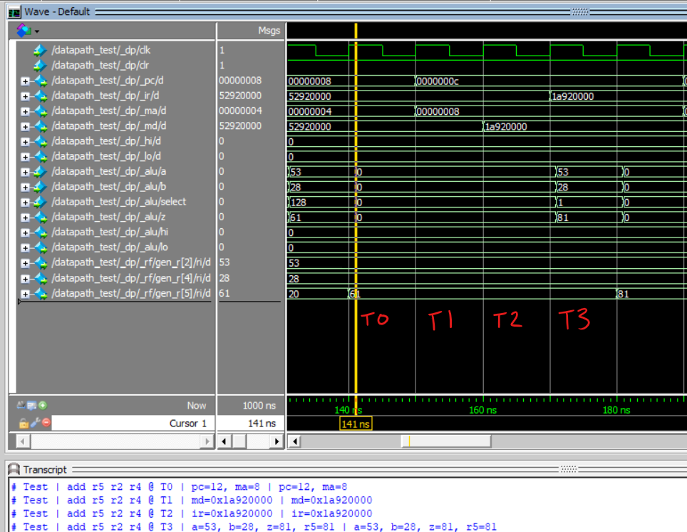
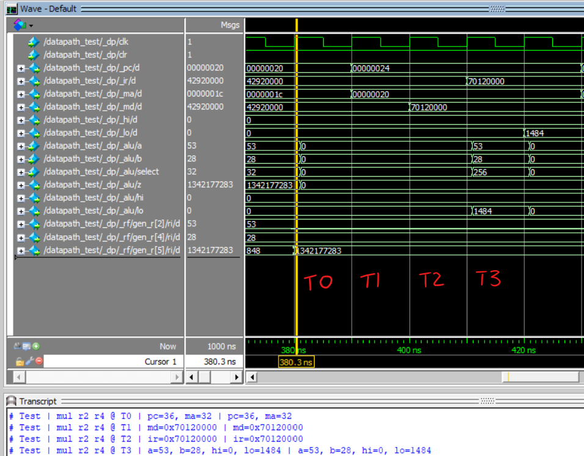
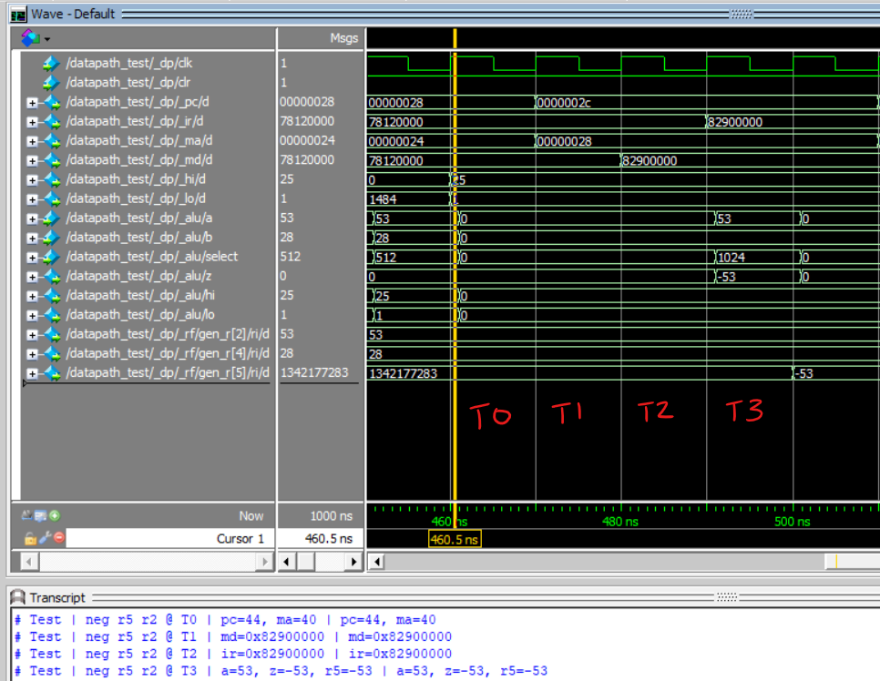

# ELEC 374 Project Phase 1 Report

**Group 42**

- Alex O'Neill, 20043101, 16amon
- Jared McGrath, 12345678, 16mickyd

## 1. Design Overview

Our design was made entirely in Verilog, using no arithmetic operators (`+`, `-`, `/` or `*`), and also implementing some logical operators (left and right shifts and rotates) entirely from scratch. We also implemented various techniques for faster addition, including a Carry Lookahead Adder and Carry Save Adder, both of which are utilized in the Multiplier.

The structure of our design is based on the 3-bus architecture referenced in the lab reader. This allowed us to remove the now redundant `A`, `B`, `Y`, and `Z` registers, and greatly simply interconnections between components of our datapath.

All of the modules we wrote have testbench modules included in the same module - for example, the `datapath` module has a `datapath_test` module both declared in the `datapath.v` file. We used a combination of a Makefile, and the ModelSim command line interface in order to run automatic tests. We use `$display()` calls to observe expected and actual outputs, and then report any differences by simulating the designs.

All our code is included in the attached `.zip` file. The module structure of the design is as follows:

- `cpu` : The top level module (empty, except for creating a `datapath` in Phase 1)
    - `datapath` : Contains all Phase 1 logic
	    - `alu` : The ALU, containing all ALU operations required for Phase 1 in various sub-modules.
		- `register_file` : The general purpose register file for registers `r0` - `r15`
		- `register` : A simple register used for `PC`, `IR`, `MD`, `MA`, `HI` and `LO` registers.

## 2. Testbench Waveforms

We tested all the required datapath instructions in a single test module (the `datapath_test` one), via simulating them sequentially as they pass through the datapath.

### Testing ADD Instruction

The `add r5, r2, r4` instruction has the following RTN, under our datapath:

- T0: `PC <- PC + 4`, `MA <- PC`
- T1: `MD <- Memory[MA]`
- T2: `IR <- MD`
- T3: `rX <- rY + rZ`

This translates to the following sequence of control signals:

- T0: `pc_increment <= 1'b1; ma_in_pc <= 1'b1;` (Increment `PC`, and load `MA` from `PC`)
- T1: `md_in_memory <= 1'b1;` (Load `MD` from memory)
- T2: `ir_en <= 1'b1;` (Load `IR`)
- T3:
    - `rf_z_addr <= 4'b0101;` Write register rZ = r5
	- `rf_a_addr <= 4'b0010;` Read register rX = r2
	- `rf_b_addr <= 4'b0100;` Read register rY = r4
	- `alu_a_in_rf <= 1'b1;` Select the ALU `A` input to be from rX
	- `alu_b_in_rf <= 1'b1;` Select the ALU `B` input to be from rY
	- `rf_in_alu <= 1'b1;` Write Enable for rZ
	- `alu_add <= 1'b1;` Set the ALU `ADD` flag (visible on the waveform as `alu_select = ????`)

The waveform of this instruction, highlighting all the relavant registers as the data passes through them is pictured below:

The RTN, control signals, and waveform for `add`, `sub`, `and`, `or`, `shl`, `shr`, `rol`, `ror` are all identical, except for the choice of control signal, and so we omitted them. However, the testbench code for each instruction can be found in the `datapath_test` module.

### Testing MUL Instruction

The `mul r2, r4` instruction has the following RTN, under our datapath:

- T0: `PC <- PC + 4`, `MA <- PC`
- T1: `MD <- Memory[MA]`
- T2: `IR <- MD`
- T3: `HI, LO <- rY * rZ`

This translates to the following sequence of control signals:

- T0: `pc_increment <= 1'b1; ma_in_pc <= 1'b1;` (Increment `PC`, and load `MA` from `PC`)
- T1: `md_in_memory <= 1'b1;` (Load `MD` from memory)
- T2: `ir_en <= 1'b1;` (Load `IR`)
- T3:
    - `rf_z_addr <= 4'b0101;` Write register rZ = r5
	- `rf_a_addr <= 4'b0010;` Read register rX = r2
	- `rf_b_addr <= 4'b0100;` Read register rY = r4
	- `alu_a_in_rf <= 1'b1;` Select the ALU `A` input to be from rX
	- `alu_b_in_rf <= 1'b1;` Select the ALU `B` input to be from rY
	- `lo_en <= 1'b1;` Write Enable for `LO`
	- `hi_en <= 1'b1;` Write Enable for `HI`
	- `alu_mul <= 1'b1;` Set the ALU `ADD` flag (visible on the waveform as `alu_select = 256 = 0b000100000000`)

The waveform of this instruction, highlighting all the relavant registers as the data passes through them is pictured below:

The RTN, control signals, and waveform for `mul` and `div` are all identical, except for the choice of control signal, and so we omitted the `div` instruction.

### Testing NEG Instruction

The `neg r5, r2` instruction has the following RTN, under our datapath:

- T0: `PC <- PC + 4`, `MA <- PC`
- T1: `MD <- Memory[MA]`
- T2: `IR <- MD`
- T3: `rX <- -(rY)`

This translates to the following sequence of control signals:

- T0: `pc_increment <= 1'b1; ma_in_pc <= 1'b1;` (Increment `PC`, and load `MA` from `PC`)
- T1: `md_in_memory <= 1'b1;` (Load `MD` from memory)
- T2: `ir_en <= 1'b1;` (Load `IR`)
- T3:
    - `rf_z_addr <= 4'b0101;` Write register rZ = r5
	- `rf_a_addr <= 4'b0010;` Read register rX = r2
	- `alu_a_in_rf <= 1'b1;` Select the ALU `A` input to be from rX
	- `rf_in_alu <= 1'b1;` Write Enable for rZ
	- `alu_neg <= 1'b1;` Set the ALU `NEG` flag (visible on the waveform as `alu_select = ????`)

The waveform of this instruction, highlighting all the relavant registers as the data passes through them is pictured below:

The RTN, control signals, and waveform for `neg` and `not` are identical, except for the choice of control signal, and so we omitted the `not` instruction.

