# ELEC 374 Project Phase 2 Report

**Group 42**

- Alex O'Neill, 20043101, 16amon
- Jared McGrath, 20053313, 16jtm2

## 1. Design Overview

Our design was made entirely in Verilog, using no arithmetic operators (`+`, `-`, `/` or `*`), and also implementing some logical operators (left and right shifts and rotates) entirely from scratch. We also implemented various techniques for faster addition, including a Carry Lookahead Adder and Carry Save Adder, both of which are utilized in the Multiplier.

The structure of our design is based on the 3-bus architecture referenced in the lab reader. This allowed us to remove the now redundant `A`, `B`, `Y`, and `Z` registers, and greatly simplify interconnections between components of our datapath. An overview of the datapath, bus interconnections, and control signals is located in Appendix A below.

In addition to the specification in the Phase 1 and 2 documents, and the lab reader, we also implemented a IEEE-754 compliant floating point unit, which supports the following operations:

- Casts (both signed and unsigned) to and from integers.
- Floating point addition, subtraction, and multiplication, and reciprocal.

All of the modules we wrote have testbench modules included in the same module - for example, the `cpu` module has a `cpu_test` module both declared in the `cpu.v` file. We used a combination of a Makefile, and the ModelSim command line interface in order to run automatic tests. We use `$display()` calls to observe expected and actual outputs, and then report any differences by simulating the designs.

All our code is included in the attached `.zip` file. The module structure of the design is as follows:

- `cpu` : The top level module.
  - `register_file` : The general purpose register file for registers `r0` - `r15`
  - `register` : A simple register used for `PC`, `IR`, `MD`, `MA`, `HI` and `LO` registers.
  - `alu` : The ALU, containing all basic arithmetic and logic operations, some in sub-modules.
  - `fpu` : The Floating Point Unit, containing all floating point arithmetic operations. Interfaces with the ALU (in order to do floating point multiplication).
  - `memory` : The main instruction and data memory, written in Verilog and inferred by Quartus into built-in memory blocks.

<div style="page-break-after: always;"></div>

## 2. Testbench Waveforms

We tested all the required instructions in a single test module (the `cpu_test` one), via simulating them sequentially as they pass through the cpu. For this, we used the assembly program (included with the project submission, in `cpu_testbench.s`, and in Appendix B below), which we wrote a primitive assembler to compile to a `.mem` file, which was loaded with Verilog's `$readmemh()` for the purpose of our testbench. The compiled output of this program is visible in `cpu_testbench.mem`, which is included alongside our Verilog code and in Appendix C below.

### `ld Ra, C`

Note that this is an alias for `ld Ra, C(Rb)` with `Rb = r0`.

The `ld` instruction has the following RTN and control signal assertions:

- T0: `PC <- PC + 4`, `MA <- PC`
  - `pc_increment <= 1'b1`; `ma_in_pc <= 1'b1`;
- T1: `MD <- Memory[MA]`
  - N/A
- T2: `IR <- MD`
  - `ir_en <= 1'b1`;
- T3: `MA <- Rb + C`
  - `alu_a_in_rf <= 1'b1`; `alu_b_in_constant <= 1'b1`; `ma_in_alu <= 1'b1`; `alu_add <= 1'b1`;
- T4: `MD <- Memory[MA]`
  - N/A
- T5: `Ra <- MD`
  - `rf_in_memory <= 1'b1`;

Test instruction `ld r1, 85`; machine code `0x00800055`.

The memory at address `85` was initialized to `0xa`. In T3, `constant_c` is set to `0x55` = `85`, to calculate the memory address in `MA`. In T5, the `memory_out` signal containing the contents of `MD`, equal to `0xA` is loaded into the register file `r1` register.

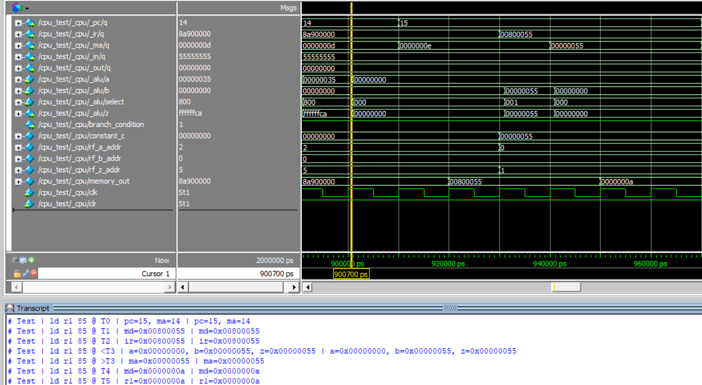

<div style="page-break-after: always;"></div>

### `ld Ra, C(Rb)`

See above for RTN and control signal assertions.

Test instruction `ld r0, 35(r1)`; machine code `0x00080023`.

The memory at address `45` = `0xA + 35` was initialized to `0xdeadbeef`. In T3, `constant_c` is set to `0x23` = `35`. The value of `r1` is also mapped to the ALU 'a' input signal, resulting in the address `0x2D` loaded into `MA`. In T5, the `memory_out` signal containing the contents of `MD`, equal to `0xdeadbeef` is loaded into the register file `r0` register.

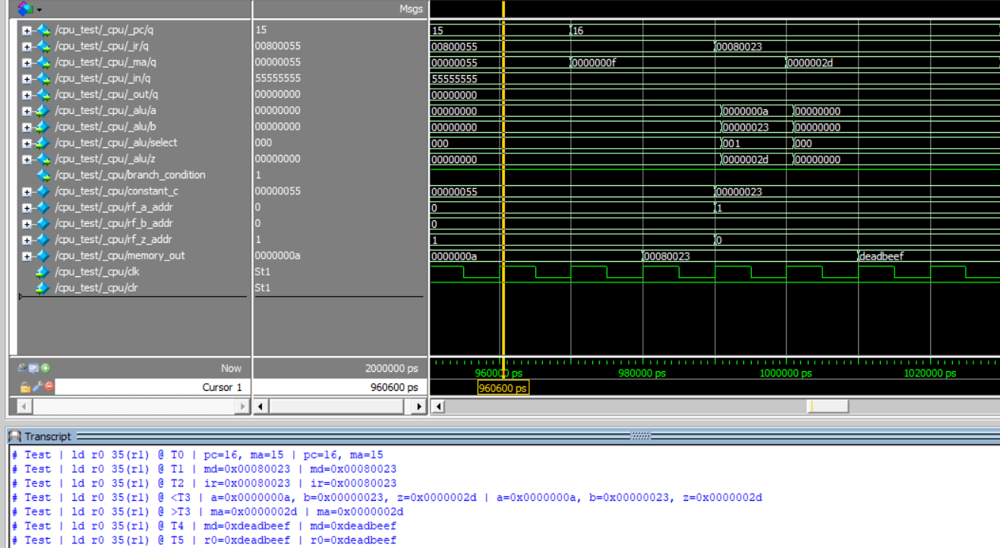

### `ldi Ra, C`

Note that this is an alias for `ldi Ra, C(Rb)` with `Rb = r0`.

The `ldi` instruction has the following RTN and control signal assertions:

- T0: `PC <- PC + 4`, `MA <- PC`
  - `pc_increment <= 1'b1`; `ma_in_pc <= 1'b1`;
- T1: `MD <- Memory[MA]`
  - N/A
- T2: `IR <- MD`
  - `ir_en <= 1'b1`;
- T3: `Ra <- Rb + C`
  - `alu_a_in_rf <= 1'b1`; `alu_b_in_constant <= 1'b1`; `rf_in_alu <= 1'b1`; `alu_add <= 1'b1`;

Test instruction `ldi r1, 85`; machine code `0x08800055`.

In `T3`, the `constant_c` is set to `0x55` = `85`, and the ALU 'a' input is set to zero. As a result, `r1` is loaded with the value `85`.

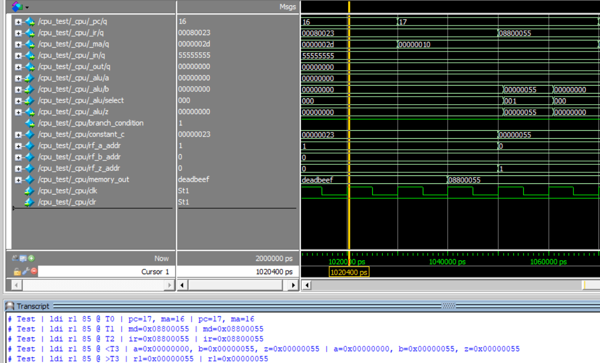

### `ldi Ra, C(Rb)`

See above for RTN and control signal assertions.

Test instruction `ldi r0, 35(r1)`; machine code `0x08080023`.

In this case, the value of `r0` is set to the sum of `r1` (85, from the previous instruction), and 35 (the `constant_c` signal). In T3, both values are present in the ALU inputs, and loaded into `r0`.

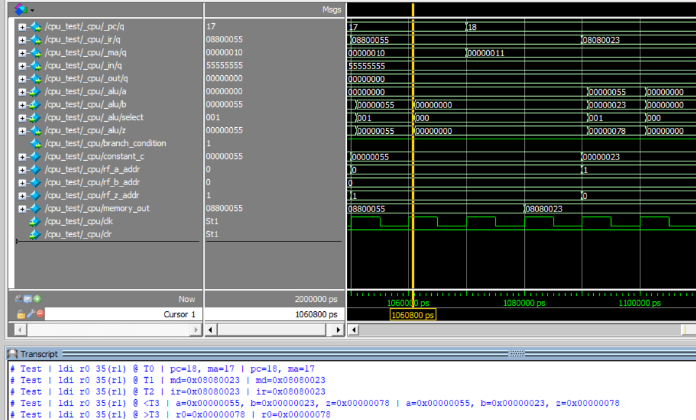

### `st C, Ra`

Note that this is an alias for `st C(Rb), Ra` with `Rb = r0`.

The `st` instruction has the following RTN and control signal assertions:

- T0: `PC <- PC + 4`, `MA <- PC`
  - `pc_increment <= 1'b1`; `ma_in_pc <= 1'b1`;
- T1: `MD <- Memory[MA]`
  - N/A
- T2: `IR <- MD`
  - `ir_en <= 1'b1`;
- T3: `MA <- Rb + C`
  - `alu_a_in_rf <= 1'b1`; `alu_b_in_constant <= 1'b1`; `ma_in_alu <= 1'b1`; `alu_add <= 1'b1`;
- T4: `Memory[MA] <- Ra`
  - `memory_en <= 1'b1`;

Test instruction `st 90, r1`; machine code `0x1080005a`.

In T3, the `constant_c` signal is set to `0x5A` = `90`, and in T4, the `MA` output is loaded as `90`, due to the implicit presence of `r0`, despite the `r0` register having a non-zero value. In `T4`, the value of r1 is sent to the memory, and `85` is loaded at memory address `0x5A`.

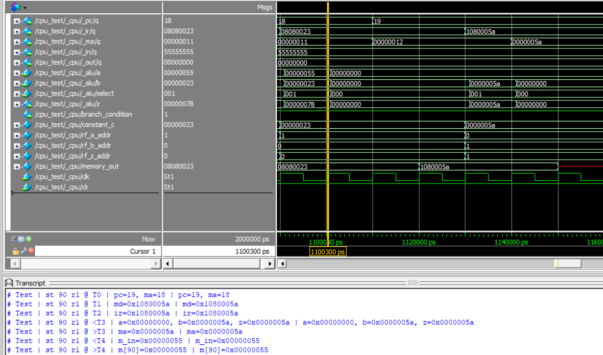

### `st C(Rb), Ra`

See above for RTN and control signal assertions.

Test instruction `st 90(r1), r1`; machine code `0x1088005a`.

In this case, the `constant_c` signal is set to `0x5A`, and the 'a' input to the ALU is set to the value of `r1`, resulting in `MA` being loaded with `0xAF`. In `T4`, the value of r1 is sent to the memory, and `85` is loaded at memory address `0xAF`.

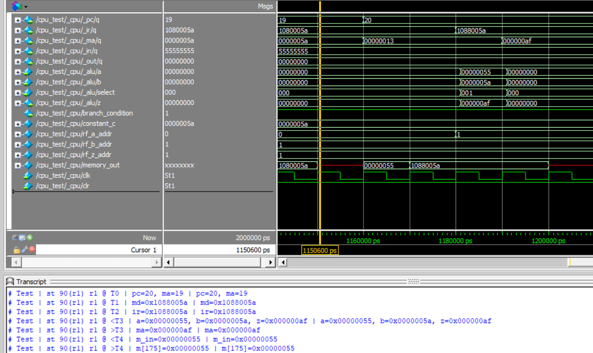

### `addi Ra, Rb, C`

The `addi` instruction has the same RTN and control signal assertions as the `ldi` instruction:

- T0: `PC <- PC + 4`, `MA <- PC`
  - `pc_increment <= 1'b1`; `ma_in_pc <= 1'b1`;
- T1: `MD <- Memory[MA]`
  - N/A
- T2: `IR <- MD`
  - `ir_en <= 1'b1`;
- T3: `Ra <- Rb + C`
  - `alu_a_in_rf <= 1'b1`; `alu_b_in_constant <= 1'b1`; `rf_in_alu <= 1'b1`; `alu_add <= 1'b1`;

Test instruction `addi r2, r1, -5`; machine code `0x590ffffb`.

In `T3`, the value of r1 is present in the ALU 'a' input, and the sign-extended `constant_c` signal, `0xFFFFFFFB` = `-5` is present in the ALU 'b' input, and the sum `0x50` is loaded into the r2 register.

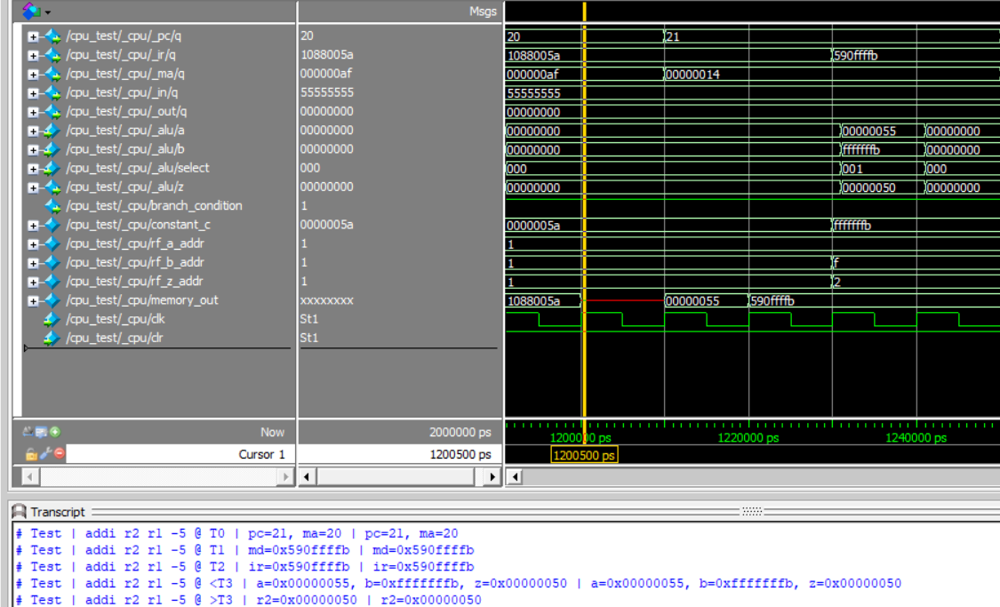

### `andi Ra, Rb, C`

The `andi` instruction has the following RTN and control signal assertions:

- T0: `PC <- PC + 4`, `MA <- PC`
  - `pc_increment <= 1'b1`; `ma_in_pc <= 1'b1`;
- T1: `MD <- Memory[MA]`
  - N/A
- T2: `IR <- MD`
  - `ir_en <= 1'b1`;
- T3: `Ra <- Rb & C`
  - `alu_a_in_rf <= 1'b1`; `alu_b_in_constant <= 1'b1`; `rf_in_alu <= 1'b1`; `alu_and <= 1'b1`;

Test instruction `andi r2, r1, 26`; machine code `0x6108001a`.

In `T3`, the value of r1 is present in the ALU 'a' input, and the sign-extended `constant_c` signal, `0x1A`, is present in the ALU 'b' input, and the bitwise and of the inputs, `0x10` is loaded into the r2 register.

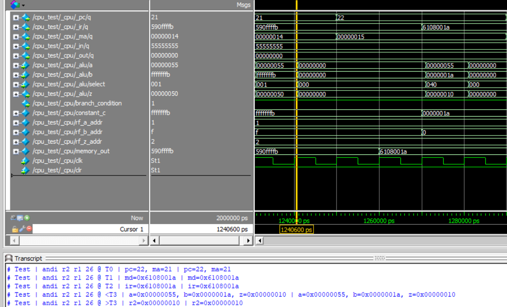

### `ori Ra, Rb, C`

The `ori` instruction has the following RTN and control signal assertions:

- T0: `PC <- PC + 4`, `MA <- PC`
  - `pc_increment <= 1'b1`; `ma_in_pc <= 1'b1`;
- T1: `MD <- Memory[MA]`
  - N/A
- T2: `IR <- MD`
  - `ir_en <= 1'b1`;
- T3: `Ra <- Rb | C`
  - `alu_a_in_rf <= 1'b1`; `alu_b_in_constant <= 1'b1`; `rf_in_alu <= 1'b1`; `alu_or <= 1'b1`;

Test instruction `ori r2, r1, 26`; machine code `0x6908001a`.

In `T3`, the value of r1 is present in the ALU 'a' input, and the sign-extended `constant_c` signal, `0x1A`, is present in the ALU 'b' input, and the bitwise and of the inputs, `0x5F` is loaded into the r2 register.

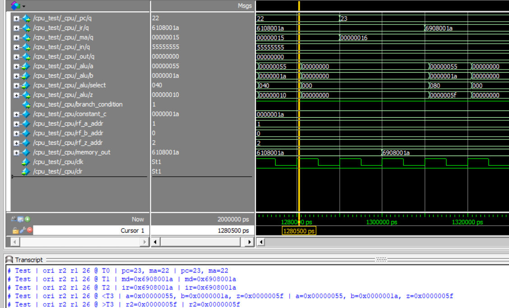

### `brzr Ra, C`

The `brzr` instruction has the following RTN and control signal assertions:

- T0: `PC <- PC + 4`, `MA <- PC`
  - `pc_increment <= 1'b1`; `ma_in_pc <= 1'b1`;
- T1: `MD <- Memory[MA]`
  - N/A
- T2: `IR <- MD`
  - `ir_en <= 1'b1`;
- T3 `if (rA == 0) then PC <- PC + C`
  - `alu_a_in_pc <= 1'b1`; `alu_b_in_constant <= 1'b1`; `pc_in_alu <= branch_condition`; `alu_add <= 1'b1`;

Test instruction `brzr r2, 35`; machine code `0x91000023`.

The values of `PC` and `r2` at beginning of this instruction are `0x17` and `0x5f`, respectively.
In T0, PC is automatically incremented to `0x18`.
In T2, the instruction is decoded, setting `rf_a_addr <= 4'b0010` and `branch_condition <= rf_a_out == 32'b0`. `branch_condition` will be `0`, because `r2` is non-zero.
In T3, we prepare for the possibility of a branch, computing `PC + C` by asserting `alu_a_in_pc <= 1'b1`, `alu_b_in_constant <= 1'b1`, and `alu_add <= 1'b1` (connecting `alu_a_in <= pc_out`, `alu_b_in <= constant_c`, respectively). The decision is selected by the `pc_in_alu <= branch_condition` assertion.

We see that the ALU computes the sum `pc` (`0x18`) + `35` (`alu_z_out` equal to `0x3b`). Because `branch_condition` is `0`, `pc` is still equal to `0x18` at the end of T3, completing a 'branch not-taken'.

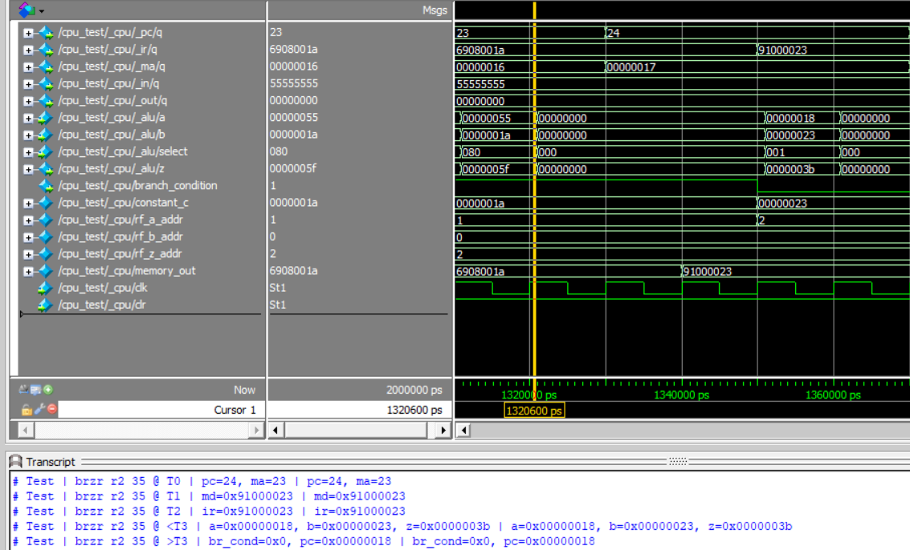

### `brnz Ra, C`

The `brnz` instruction has the following RTN and control signal assertions:

- T0: `PC <- PC + 4`, `MA <- PC`
  - `pc_increment <= 1'b1`; `ma_in_pc <= 1'b1`;
- T1: `MD <- Memory[MA]`
  - N/A
- T2: `IR <- MD`
  - `ir_en <= 1'b1`;
- T3 `if (rA != 0) then PC <- PC + C`
  - `alu_a_in_pc <= 1'b1`; `alu_b_in_constant <= 1'b1`; `pc_in_alu <= branch_condition`; `alu_add <= 1'b1`;

Test instruction `brnz r2, 35`; machine code `0x91080023`.

The values of `PC` and `r2` at beginning of this instruction are `0x18` and `0x5f`, respectively.
In T0, PC is automatically incremented to `0x19`.
In T2, the instruction is decoded, setting `rf_a_addr <= 4'b0010` and `branch_condition <= rf_a_out != 32'b0`. `branch_condition` will be `1`, because `r2` is non-zero.
In T3, we prepare for the possibility of a branch, computing `PC + C` by asserting `alu_a_in_pc <= 1'b1`, `alu_b_in_constant <= 1'b1`, and `alu_add <= 1'b1` (connecting `alu_a_in <= pc_out`, `alu_b_in <= constant_c`, respectively). The decision is selected by the `pc_in_alu <= branch_condition` assertion.

We see that the ALU computes the sum `pc` (`0x19`) + `35` (`alu_z_out` equal to `0x3c`). Because `branch_condition` is `1`, the connection `pc_in <= alu_z_out` is made. The value of `pc` is `0x3c` at the end of T3, completing a 'branch taken'.

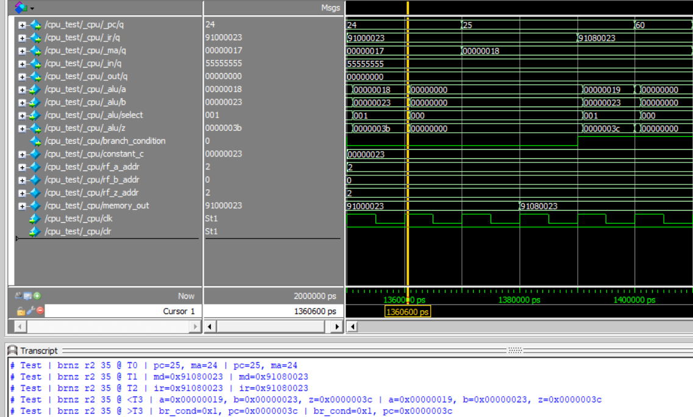

### `brpl Ra, C`

The `brpl` instruction has the following RTN and control signal assertions:

- T0: `PC <- PC + 4`, `MA <- PC`
  - `pc_increment <= 1'b1`; `ma_in_pc <= 1'b1`;
- T1: `MD <- Memory[MA]`
  - N/A
- T2: `IR <- MD`
  - `ir_en <= 1'b1`;
- T3 `if (rA > 0) then PC <- PC + C`
  - `alu_a_in_pc <= 1'b1`; `alu_b_in_constant <= 1'b1`; `pc_in_alu <= branch_condition`; `alu_add <= 1'b1`;

Test instruction `brpl r2, 35`; machine code `0x91100023`.

The values of `PC` and `r2` at beginning of this instruction are `0x19` and `0x5f`, respectively.
In T0, PC is automatically incremented to `0x1a`.
In T2, the instruction is decoded, setting `rf_a_addr <= 4'b0010` and `branch_condition <= !rf_a_out[31] && (| rf_a_out[30:0])`. `branch_condition` will be `1`, because `r2` is positive.
In T3, we prepare for the possibility of a branch, computing `PC + C` by asserting `alu_a_in_pc <= 1'b1`, `alu_b_in_constant <= 1'b1`, and `alu_add <= 1'b1` (connecting `alu_a_in <= pc_out`, `alu_b_in <= constant_c`, respectively). The decision is selected by the `pc_in_alu <= branch_condition` assertion.

We see that the ALU computes the sum `pc` (`0x1a`) + `35` (`alu_z_out` equal to `0x3d`). Because `branch_condition` is `1`, the connection `pc_in <= alu_z_out` is made. The value of `pc` is `0x3d` at the end of T3, completing a 'branch taken'.

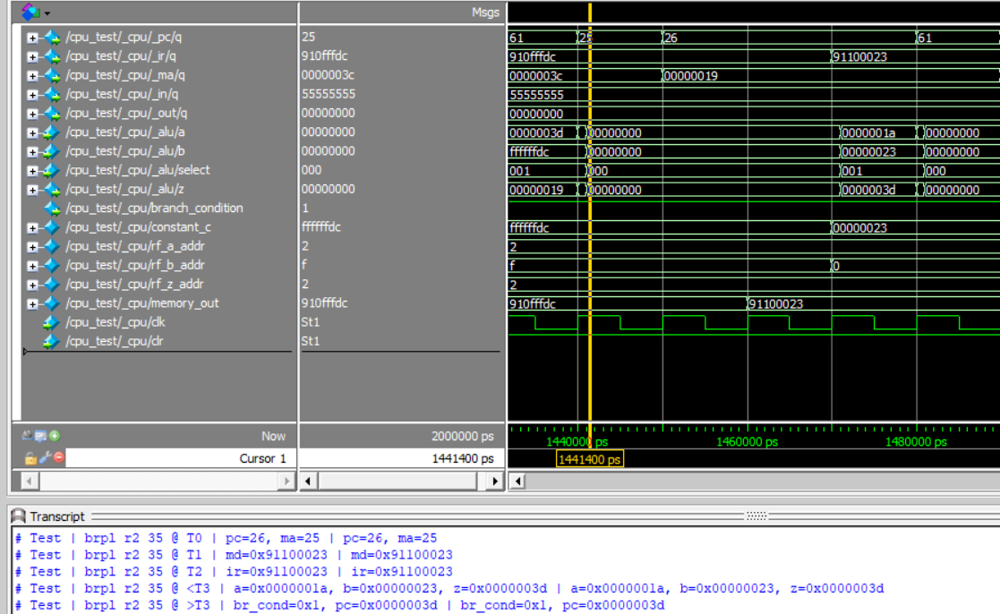

### `brmi Ra, C`

The `brmi` instruction has the following RTN and control signal assertions:

- T0: `PC <- PC + 4`, `MA <- PC`
  - `pc_increment <= 1'b1`; `ma_in_pc <= 1'b1`;
- T1: `MD <- Memory[MA]`
  - N/A
- T2: `IR <- MD`
  - `ir_en <= 1'b1`;
- T3 `if (rA < 0) then PC <- PC + C`
  - `alu_a_in_pc <= 1'b1`; `alu_b_in_constant <= 1'b1`; `pc_in_alu <= branch_condition`; `alu_add <= 1'b1`;

Test instruction `brmi r2, 35`; machine code `0x91180023`.

The values of `PC` and `r2` at beginning of this instruction are `0x1a` and `0x5f`, respectively.
In T0, PC is automatically incremented to `0x1b`.
In T2, the instruction is decoded, setting `rf_a_addr <= 4'b0010` and `branch_condition <= rf_a_out[31]`. `branch_condition` will be `0`, because `r2` is non-negative.
In T3, we prepare for the possibility of a branch, computing `PC + C` by asserting `alu_a_in_pc <= 1'b1`, `alu_b_in_constant <= 1'b1`, and `alu_add <= 1'b1` (connecting `alu_a_in <= pc_out`, `alu_b_in <= constant_c`, respectively). The decision is selected by the `pc_in_alu <= branch_condition` assertion.

We see that the ALU computes the sum `pc` (`0x1b`) + `35` (`alu_z_out` equal to `0x3e`). Because `branch_condition` is `0`, `pc` is still equal to `0x1b` at the end of T3, completing a 'branch not-taken'.

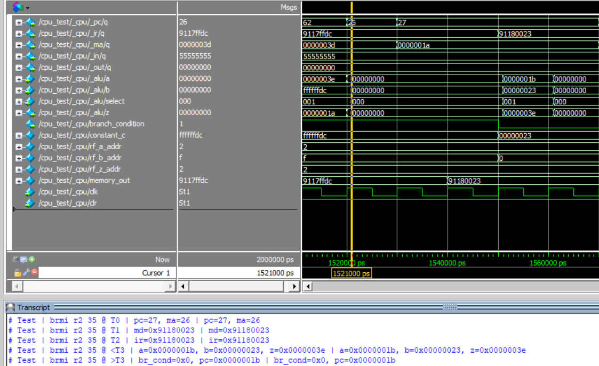

### `jal Ra`

The `jal` instruction has the following RTN and control signal assertions:

- T0: `PC <- PC + 4`, `MA <- PC`
  - `pc_increment <= 1'b1`; `ma_in_pc <= 1'b1`;
- T1: `MD <- Memory[MA]`
  - N/A
- T2: `IR <- MD`
  - `ir_en <= 1'b1`;
- T3 `PC <- rA`, `r15 <- PC`
  - `alu_a_in_pc <= 1'b1`; `rf_in_alu <= 1'b1`; `alu_add <= 1'b1`;
  - `pc_in_rf_a <= 1'b1`;

Test instruction `jal r1`; machine code `0xa0800000`.

The values of `PC` and `r1` prior to this instruction are `0x1c` and `0x3e`, respectively.
In T0, PC is automatically incremented to `0x1d`.
In T2, the instruction is decoded, setting `rf_z_addr <= 4'b1111` (since we always write to `r15`) and `rf_a_addr <= 4'b0001`.

In T3, we do two things:

1. Our datapath does not allow for a direct connection from `rf_in <= pc_out`. Instead, we force the value of `pc_out` through the ALU (`alu_a_in_pc <= 1'b1`) with an add (`alu_add <= 1'b1`). The second input to the ALU, `alu_b_in`, defaults to `32'b0` when none of the relevant control signals are asserted (essentially a noop). Lastly, we assert `rf_in_alu <= 1'b1`, connecting `rf_in <= alu_z_out`.
2. `pc_in_rf_a` control signal is asserted, connecting `pc_in <= rf_a_out`.

When taken together, we see the following:

- `alu_z_out` is equal to `pc_out` (`0x1d`)
- The value of `alu_z_out` is written to `r15`
- The value of `r1` (`0x3e`) is written to `pc`

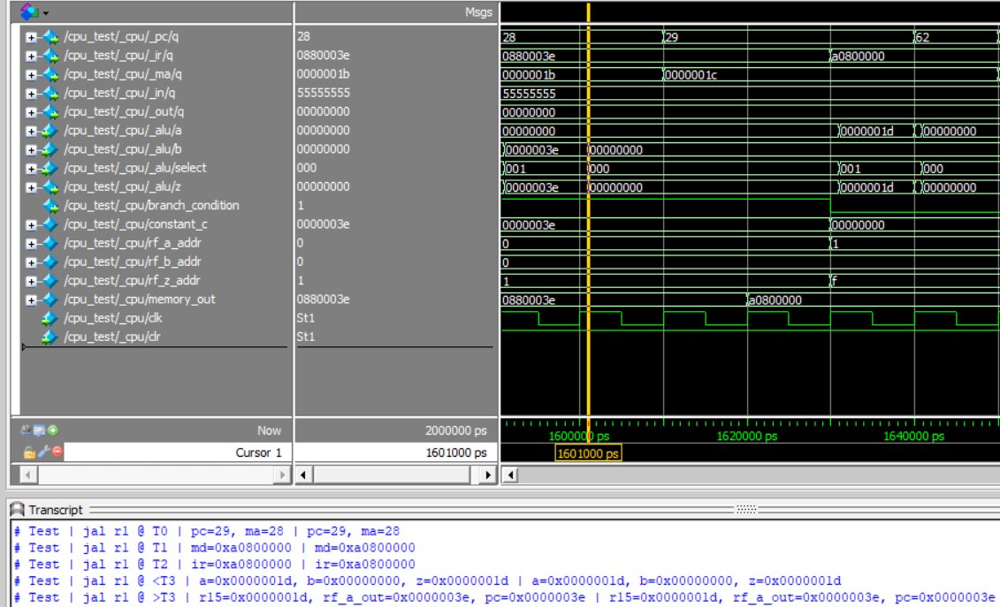

### `jr Ra`

The `jr` instruction has the following RTN and control signal assertions:

- T0: `PC <- PC + 4`, `MA <- PC`
  - `pc_increment <= 1'b1`; `ma_in_pc <= 1'b1`;
- T1: `MD <- Memory[MA]`
  - N/A
- T2: `IR <- MD`
  - `ir_en <= 1'b1`;
- T3 `PC <- rA`
  - `pc_in_rf_a <= 1'b1`;

Test instruction `jr r15`; machine code `0x9f800000`.

The value of `r15` prior to this instruction is `0x1d`.
In T2, the instruction is decoded, setting `rf_a_addr <= 4'b1111`.
In T3, the `pc_in_rf_a` control signal is asserted, connecting `pc_in <= rf_a_out`. At the end of T3, we see the value of `r15` (`0x1d`) is written to `pc`.

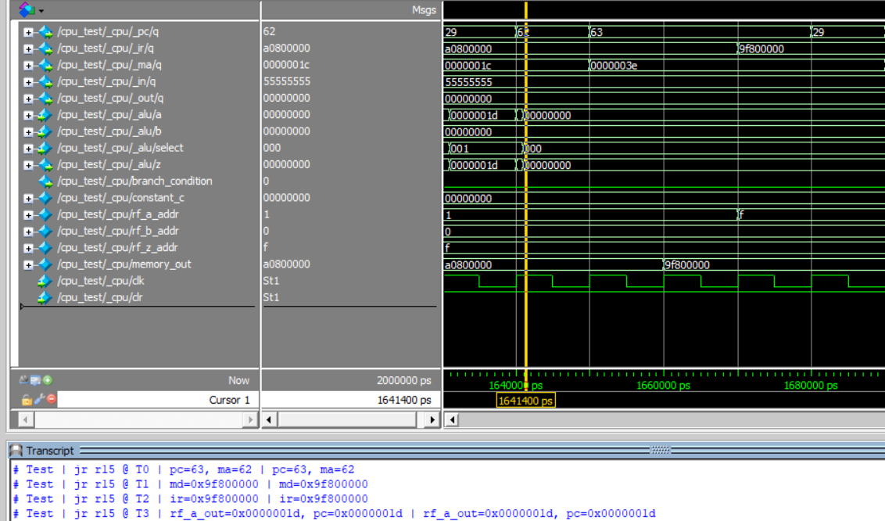

### `mfhi Ra`

The `mfhi` instruction has the following RTN and control signal assertions:

- T0: `PC <- PC + 4`, `MA <- PC`
  - `pc_increment <= 1'b1`; `ma_in_pc <= 1'b1`;
- T1: `MD <- Memory[MA]`
  - N/A
- T2: `IR <- MD`
  - `ir_en <= 1'b1`;
- T3 `Ra <- HI`
  - `rf_in_hi <= 1'b1`;

Test instruction `mfhi r2`; machine code `0xb9000000`.

The value of `HI` prior to this instruction is `0x19`.
In T2, the instruction is decoded, setting `rf_z_addr <= 4'b0010`.
In T3, the `rf_in_hi` control signal is asserted, connecting `rf_in <= hi_out`. At the end of T3, we see the value of `hi_out` (`0x19`) is written to `r2`.

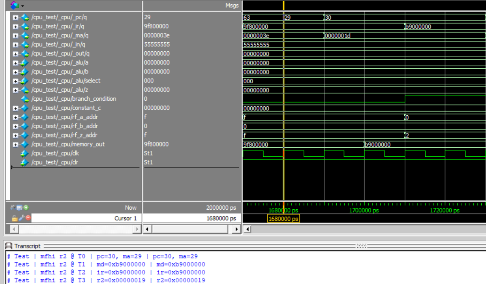

### `mflo Ra`

The `mflo` instruction has the following RTN and control signal assertions:

- T0: `PC <- PC + 4`, `MA <- PC`
  - `pc_increment <= 1'b1`; `ma_in_pc <= 1'b1`;
- T1: `MD <- Memory[MA]`
  - N/A
- T2: `IR <- MD`
  - `ir_en <= 1'b1`;
- T3 `Ra <- LO`
  - `rf_in_lo <= 1'b1`;

Test instruction `mflo r2`; machine code `0xc1000000`.

The value of `LO` prior to this instruction is `0x1`.
In T2, the instruction is decoded, setting `rf_z_addr <= 4'b0010`.
In T3, the `rf_in_lo` control signal is asserted, connecting `rf_in <= lo_out`. At the end of T3, we see the value of `lo_out` (`0x1`) is written to `r2`.

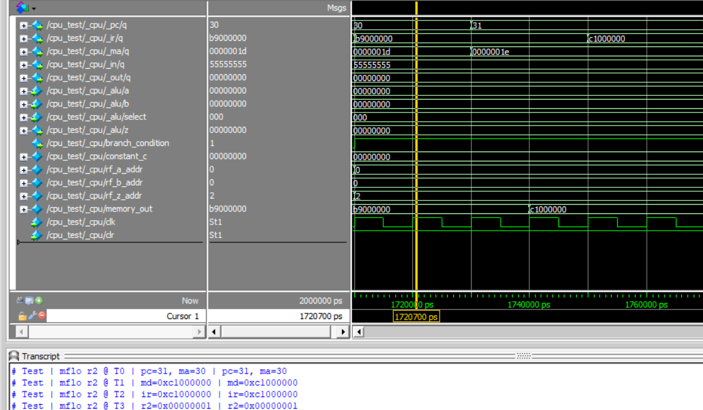

### `out Ra`

The `out` instruction has the following RTN and control signal assertions:

- T0: `PC <- PC + 4`, `MA <- PC`
  - `pc_increment <= 1'b1`; `ma_in_pc <= 1'b1`;
- T1: `MD <- Memory[MA]`
  - N/A
- T2: `IR <- MD`
  - `ir_en <= 1'b1`;
- T3 `Out.Port <- Ra`
  - `output_en <= 1'b1`;

Test instruction `out r1`; machine code `0xb0800000`.

The value of `r1` prior to this instruction is `0x0000003e`.
In T2, the instruction is decoded, setting `rf_a_addr <= 4'b0001`.
In T3, the `output_en` control signal is asserted, enabling writing to the output register. Note that the output register's input is always connected to `rf_a_out`. As such, we see the value of `r1` (`0x55555555`) written to `output_out`.

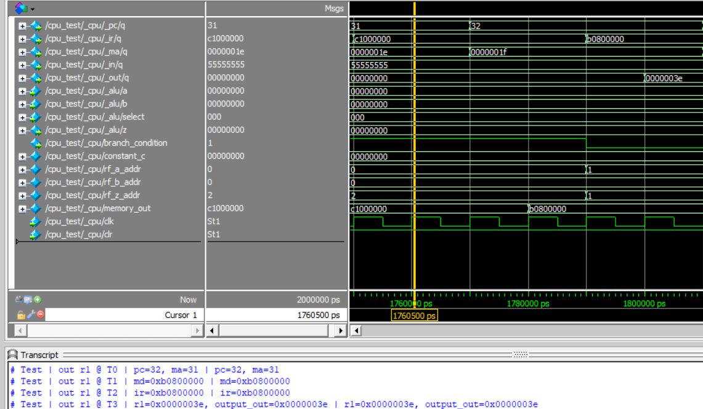

### `in Ra`

The `in` instruction has the following RTN and control signal assertions:

- T0: `PC <- PC + 4`, `MA <- PC`
  - `pc_increment <= 1'b1`; `ma_in_pc <= 1'b1`;
- T1: `MD <- Memory[MA]`
  - N/A
- T2: `IR <- MD`
  - `ir_en <= 1'b1`;
- T3 `Ra <- In.Port`
  - `rf_in_input <= 1'b1`;

Test instruction `in r1`; machine code `0xa8800000`.

At the beginning of the testbench, input was initialized by setting `input_en <= 1'b1` and `input_in <= 32'h55555555`. This set `input_out <= 32'h55555555`.
In T2, the instruction is decoded, setting `rf_z_addr <= 4'b0001`.
In T3, the `rf_in_input` control signal is asserted, connecting `rf_in <= input_out`. At the end of T3, we see the value of `input_out` (`0x55555555`) is written to `r1`.

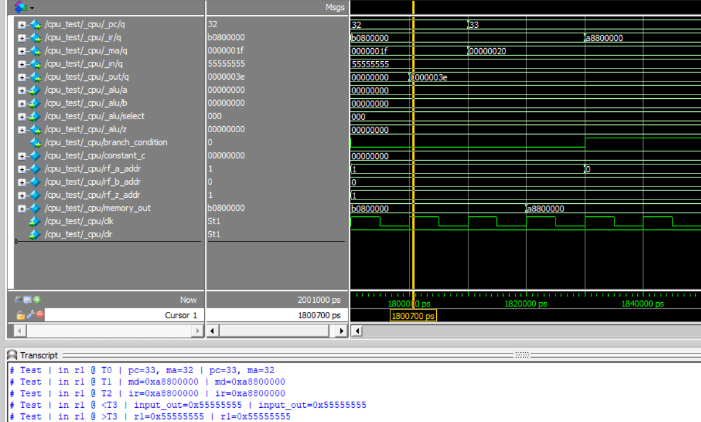

<div style="page-break-after: always;"></div>

## Appendix A: Datapath & Control Signals

Below is a summary of important wires and control signals in the data path.

### Datapath

The following components are central to the datapath, all instantiated within the `cpu` module, with various interconnections between them.

| Name      | Module          | Description                                                                           |
| --------- | --------------- | ------------------------------------------------------------------------------------- |
| `_rf`     | `register_file` | 16-word 32-bit primary register file                                                  |
| `_memory` | `memory`        | 512-word 32-bit main memory                                                           |
| `_alu`    | `alu`           | ALU                                                                                   |
| `_fpu`    | `fpu`           | Floating point unit co-processor                                                      |
| `_pc`     | `register`      | 32-bit PC register                                                                    |
| `_ir`     | `register`      | 32-bit IR register                                                                    |
| `_ma`     | `register`      | 32-bit MA special register, containing memory address                                 |
| `_hi`     | `register`      | 32-bit HI special register, containing partial result of `div` and `mul` instructions |
| `_lo`     | `register`      | 32-bit LO special register, containing partial result of `div` and `mul` instructions |
| `_in`     | `register`      | 32-bit IN special register, representing the input port                               |
| `_out`    | `register`      | 32-bit OUT special register, representing the output port                             |

There is also an instantiation of `ripple_carry_adder`, named `_pc_adder`, which computes `PC + 1`.

### Internal Bus Connections

Bus interconnection wires are listed under the datapath component that 'owns' them.

**Notes:**

- A common clock `clk` and asynchronous clear `clr` is connected to all components, both of which are inputs to the `cpu` module
- An asterisk (\*) beside a wire name denotes a data wire that is accessible via input/output port of `cpu` module

#### `_rf`

| Name        | Description    | Width | Expression                  |
| ----------- | -------------- | ----- | --------------------------- |
| `rf_in`     | Data in        | 32    |                             |
| `rf_z_addr` | Write address  | 4     |                             |
| `rf_a_addr` | Read address A | 4     |                             |
| `rf_b_addr` | Read address B | 4     |                             |
| `rf_a_out`  | Read data A    | 32    | `rf_a_out <- RF[rf_a_addr]` |
| `rf_b_out`  | Read data B    | 32    | `rf_b_out <- RF[rf_b_addr]` |

#### `_memory`

| Name         | Description | Width | Expression                     |
| ------------ | ----------- | ----- | ------------------------------ |
| `memory_out` | Read data   | 32    | `memory_out <- Memory[ma_out]` |

Note: we don't need `memory_in` because it's always wired to `rf_b_out`.

#### `_alu`

| Name         | Description                        | Width | Expression                                                                          |
| ------------ | ---------------------------------- | ----- | ----------------------------------------------------------------------------------- |
| `alu_a_in`   | Data in A                          | 32    |                                                                                     |
| `alu_b_in`   | Data in B                          | 32    |                                                                                     |
| `alu_z_out`  | Output for all but `mul` and `div` | 32    | `alu_z_out <- alu_a_in <op alu_select> alu_b_in`                                    |
| `alu_hi_out` | HI output for `mul` and `div`      | 32    | `alu_hi_out <- alu_a_in % alu_b_in` or `alu_hi_out <- (alu_a_in * alu_b_in)[63:32]` |
| `alu_lo_out` | LO output for `mul` and `div`      | 32    | `alu_hi_out <- alu_a_in // alu_b_in` or `alu_hi_out <- (alu_a_in * alu_b_in)[31:0]` |
| `rf_a_out`   | Read data A                        | 32    | `rf_a_out <- RF[rf_a_addr]`                                                         |
| `rf_b_out`   | Read data B                        | 32    | `rf_b_out <- RF[rf_b_addr]`                                                         |

#### Registers

Most registers have identical data wires that follow a common naming convention

| Name           | Description     | Width |
| -------------- | --------------- | ----- |
| `pc_in`        | `_pc` Data in   | 32    |
| `pc_out`       | `_pc` Data out  | 32    |
| `ir_out`\*     | `_ir` Data out  | 32    |
| `ma_in`        | `_ma` Data in   | 32    |
| `ma_out`       | `_ma` Data out  | 32    |
| `hi_out`       | `_hi` Data out  | 32    |
| `lo_out`       | `_lo` Data out  | 32    |
| `input_in`\*   | `_in` Data in   | 32    |
| `input_out`    | `_in` Data out  | 32    |
| `output_out`\* | `_out` Data out | 32    |

Exceptions to this scheme:

- `_ir` does not have its own input; input is always `memory_out`
- `_hi` and `_lo` do not have their own inputs; they use the ALU's `alu_hi_out` and `alu_lo_out`, respectively
- `_out` does not have its own input; input is always `rf_a_out`

#### `_fpu`

| Name               | Description                                          | Width | Expression |
| ------------------ | ---------------------------------------------------- | ----- | ---------- |
| `fpu_rz_out`       | Output of FPU                                        | 32    |            |
| `fpu_bridge_alu_a` | Passthrough to ALU in B for `fmul` if `fpu_mode = 1` | 32    |            |
| `fpu_bridge_alu_b` | Passthrough to ALU in B for `fmul` if `fpu_mode = 1` | 32    |            |

### Instruction decoding

From `ir_out`, we decode the following signals

| Name            | Description                                  | Width | Expression                      |
| --------------- | -------------------------------------------- | ----- | ------------------------------- |
| `ir_opcode`     | Opcode                                       | 5     | `ir_opcode <- ir_out[31:27]`    |
| `ir_ra`         | `Ra` field                                   | 4     | `ir_ra <- ir_out[26:23]`        |
| `ir_rb_or_c2`   | `Rb` field for R/I-format, `C2` for B-format | 4     | `ir_rb_or_c2 <- ir_out[22:19]`  |
| `ir_rc`         | `Rc` field for R-format                      | 4     | `ir_rc <- ir_out[18:15]`        |
| `ir_constant_c` | `C` field for I/B-format                     | 19    | `ir_constant_c <- ir_out[18:0]` |
| `constant_c`    | Sign-extended constant `C`                   | 32    |                                 |

From these values, we derive assignments for the following bus interconnections and control wires (see code for details):

- `rf_z_addr`
- `rf_a_addr`
- `rf_b_addr`
- `branch_condition`

### Control Signals

The following control signals exist to dictate bus interconnections. Those noted with an asterisk (\*) beside the name are controlled externally, and double asterisk (\*\*) is an output of `cpu`.

| Name                   | Description                              | Width | Expression/Action                                                                        |
| ---------------------- | ---------------------------------------- | ----- | ---------------------------------------------------------------------------------------- |
| `rf_in_alu`\*          | Connect ALU out to RF in                 | 1     | `rf_in <- alu_z_out`                                                                     |
| `rf_in_hi`\*           | Connect HI out to RF in                  | 1     | `rf_in <- hi_out`                                                                        |
| `rf_in_lo`\*           | Connect LO out to RF in                  | 1     | `rf_in <- lo_out`                                                                        |
| `rf_in_memory`\*       | Connect Memory out to RF in              | 1     | `rf_in <- memory_out`                                                                    |
| `rf_in_fpu`\*          | Connect FPU out to RF in                 | 1     | `rf_in <- fpu_rz_out`                                                                    |
| `rf_in_input`\*        | Connect Input out to RF in               | 1     | `rf_en <- input_out`                                                                     |
| `rf_en`                | Enable write to RF                       | 1     | `rf_en <- rf_in_alu \| rf_in_hi \| rf_in_lo \| rf_in_memory \| rf_in_input \| rf_in_fpu` |
| `memory_en`\*          | Enable write to memory                   | 1     | `Memory[ma_out] <- rf_b_out`                                                             |
| `alu_select`\*         | One-hot ALU operation select             | 12    |                                                                                          |
| `alu_a_in_rf`\*        | Connect RF read data A to ALU input A    | 1     | `alu_a_in <- rf_a_out`                                                                   |
| `alu_a_in_pc`\*        | Connect PC to ALU input A                | 1     | `alu_a_in <- pc_out`                                                                     |
| `alu_b_in_rf`\*        | Connect RF read data B to ALU input B    | 1     | `alu_b_in <- rf_b_out`                                                                   |
| `alu_b_in_constant`\*  | Connect constant to ALU input B          | 1     | `alu_a_in <- constant_c`                                                                 |
| `pc_increment`\*       | Connect `PC + 1` to PC in                | 1     | `pc_in <- pc_plus_1`                                                                     |
| `pc_in_alu`\*          | Connect ALU out to PC in                 | 1     | `pc_in <- alu_z_out`                                                                     |
| `pc_in_rf_a`\*         | Connect RF read data A to PC in          | 1     | `pc_in <- rf_a_out`                                                                      |
| `pc_en`                | Enable write to PC                       | 1     | `pc_en <- pc_increment \| pc_in_alu \| pc_in_rf_a`                                       |
| `ir_en`\*              | Enable write to IR                       | 1     |                                                                                          |
| `ma_in_pc`\*           | Connect PC to MA in                      | 1     | `ma_in <- pc_out`                                                                        |
| `ma_in_alu`\*          | Connect ALU out to MA in                 | 1     | `ma_in <- alu_z_out`                                                                     |
| `ma_en`                | Enable write to MA                       | 1     | `ma_en <- ma_in_pc \| ma_in_alu`                                                         |
| `hi_en`\*              | Enable write to HI                       | 1     |                                                                                          |
| `lo_en`\*              | Enable write to LO                       | 1     |                                                                                          |
| `input_en`\*           | Enable write to Input port               | 1     |                                                                                          |
| `output_en`\*          | Enable write to Output port              | 1     |                                                                                          |
| `branch_condition`\*\* | Indicates whether branch should be taken | 1     | `branch_condition <- condition(rf_a_out)`                                                |
| `fpu_select`\*         | One-hot FPU operation select             | 10    |                                                                                          |
| `fpu_mode`\*           | Determines if ALU (0) or FPU (1) is used | 1     |                                                                                          |

<div style="page-break-after: always;"></div>

## Appendix B: Assembly Program

The assembly source of `cpu_testbench.s` is shown below

```asm
// Phase 1 Setup : r2 = 53, r4 = 28
    addi r2, r0, 53
    addi r4, r0, 28

// Phase 1
    and r5, r2, r4
    or r5, r2, r4
    add r5, r2, r4
    sub r5, r2, r4
    shr r5, r2, r4
    shl r5, r2, r4
    ror r5, r2, r4
    rol r5, r2, r4
    mul r2, r4
    div r2, r4
    neg r5, r2
    not r5, r2

// Phase 2
    ld r1, 85
    ld r0, 35(r1) // Loads from 35 + 10
    ldi r1, 85
    ldi r0, 35(r1)
    st 90, r1
    st 90(r1), r1
    addi r2, r1, -5
    andi r2, r1, 26
    ori r2, r1, 26
    brzr r2, 35
    brnz r2, 35 // Will branch to 60
jump_back_1:
    brpl r2, 35 // Will branch to 61
jump_back_2:
    brmi r2, 35
    ldi r1, 62 // Non-test instruction, just to set r1 to 62 before jr
    jal r1 // Will jump to 62
    mfhi r2
    mflo r2
    out r1
    in r1

.org 60
    brnz r2, jump_back_1
    brpl r2, jump_back_2
    jr r15 // Jump return

.org 45
    .mem 0xdeadbeef
.org 85
    .mem 10
```

<div style="page-break-after: always;"></div>

## Appendix C: Memory File

The assembled output of `cpu_testbench.s` is provided below. This was generated by running `python3 assembler/main.py asm/cpu_testbench.s -o out/cpu_testbench.mem`

```data
59000035 // 000 : addi r2, r0, 53
5a00001c // 001 : addi r4, r0, 28
4a920000 // 002 : and r5, r2, r4
52920000 // 003 : or r5, r2, r4
1a920000 // 004 : add r5, r2, r4
22920000 // 005 : sub r5, r2, r4
2a920000 // 006 : shr r5, r2, r4
32920000 // 007 : shl r5, r2, r4
3a920000 // 008 : ror r5, r2, r4
42920000 // 009 : rol r5, r2, r4
71200000 // 010 : mul r2, r4
79200000 // 011 : div r2, r4
82900000 // 012 : neg r5, r2
8a900000 // 013 : not r5, r2
00800055 // 014 : ld r1, 85
00080023 // 015 : ld r0, 35(r1) // Loads from 35 + 10
08800055 // 016 : ldi r1, 85
08080023 // 017 : ldi r0, 35(r1)
1080005a // 018 : st 90, r1
1088005a // 019 : st 90(r1), r1
590ffffb // 020 : addi r2, r1, -5
6108001a // 021 : andi r2, r1, 26
6908001a // 022 : ori r2, r1, 26
91000023 // 023 : brzr r2, 35
91080023 // 024 : brnz r2, 35 // Will branch to 60
91100023 // 025 : jump_back_1: brpl r2, 35 // Will branch to 61
91180023 // 026 : jump_back_2: brmi r2, 35
0880003e // 027 : ldi r1, 62 // Non-test instruction, just to set r1 to 62 before jr
a0800000 // 028 : jal r1 // Will jump to 62
b9000000 // 029 : mfhi r2
c1000000 // 030 : mflo r2
b0800000 // 031 : out r1
a8800000 // 032 : in r1
00000000 // 033
00000000 // 034
00000000 // 035
00000000 // 036
00000000 // 037
00000000 // 038
00000000 // 039
00000000 // 040
00000000 // 041
00000000 // 042
00000000 // 043
00000000 // 044
deadbeef // 045 : .mem [1 words]
00000000 // 046
00000000 // 047
00000000 // 048
00000000 // 049
00000000 // 050
00000000 // 051
00000000 // 052
00000000 // 053
00000000 // 054
00000000 // 055
00000000 // 056
00000000 // 057
00000000 // 058
00000000 // 059
910fffdc // 060 : brnz r2, jump_back_1
9117ffdc // 061 : brpl r2, jump_back_2
9f800000 // 062 : jr r15 // Jump return
00000000 // 063
00000000 // 064
00000000 // 065
00000000 // 066
00000000 // 067
00000000 // 068
00000000 // 069
00000000 // 070
00000000 // 071
00000000 // 072
00000000 // 073
00000000 // 074
00000000 // 075
00000000 // 076
00000000 // 077
00000000 // 078
00000000 // 079
00000000 // 080
00000000 // 081
00000000 // 082
00000000 // 083
00000000 // 084
0000000a // 085 : .mem [1 words]
```
